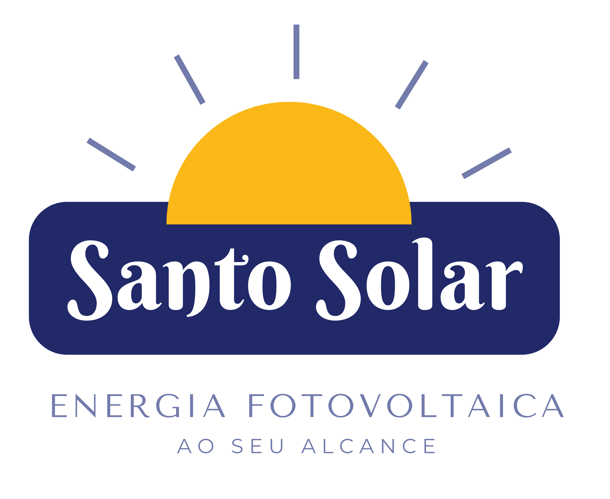

# ☀️ Santo Solar - Energia Solar ao seu alcance



A **Santo Solar** é uma plataforma moderna e de alta performance desenvolvida para promover soluções de energia solar em Santa Luzia e região. O projeto utiliza a arquitetura de **Islands** do Astro para garantir velocidade excepcional e interatividade fluida onde necessário.

## 🚀 Tecnologias Utilizadas

- **Framework Principal**: [Astro](https://astro.build/) (v6+)
- **Interatividade**: [React](https://reactjs.org/) (v19)
- **Linguagem**: [TypeScript](https://www.typescriptlang.org/)
- **Estilização**: CSS Vanilla (Moderno e Otimizado)
- **Ícones**: Font Awesome & SVGs customizados
- **SEO**: Astro SEO & Schema.org (JSON-LD)

## ✨ Principais Funcionalidades

- **Simulador de Economia**: Calculadora interativa em React que estima a economia mensal e anual baseada no perfil de consumo do usuário.
- **WhatsApp Dinâmico**: Links de contato que geram mensagens pré-programadas e personalizadas (ex: incluindo o valor da economia calculada no simulador).
- **Arquitetura de Alta Performance**: Uso de Astro Components para conteúdo estático e React para componentes interativos, maximizando o Core Web Vitals.
- **Design Premium & Responsivo**: Interface moderna com animações suaves, transições de estado e total adaptabilidade para dispositivos móveis.
- **FAQ Interativo**: Seção de dúvidas frequentes com animações de expansão otimizadas para UX.
- **Otimização de Imagens**: Uso do componente nativo `<Image />` do Astro para carregamento inteligente e conversão automática.

## 📁 Estrutura do Projeto

```text
/
├── public/              # Arquivos estáticos (favicons, manifest, db json)
├── src/
│   ├── assets/          # Imagens, ícones e CSS global
│   ├── components/
│   │   ├── astro/       # Componentes estáticos de alta performance
│   │   └── react/       # Componentes interativos (Ilhas React)
│   ├── layouts/         # Templates base das páginas
│   └── pages/           # Rotas do projeto (Astro)
├── astro.config.mjs     # Configurações do Astro
└── package.json         # Dependências e scripts
```

## 🛠️ Como Executar o Projeto

1. **Instale as dependências**:
   ```bash
   npm install
   ```

2. **Inicie o servidor de desenvolvimento**:
   ```bash
   npm run dev
   ```

3. **Gere o build de produção**:
   ```bash
   npm run build
   ```

## 📄 Licença

Este projeto foi desenvolvido para a **Santo Solar**. Todos os direitos reservados.

---
Desenvolvido com ❤️ por [Isaac N. Reis](https://isaacnasreis.github.io/portfolio-js/)
